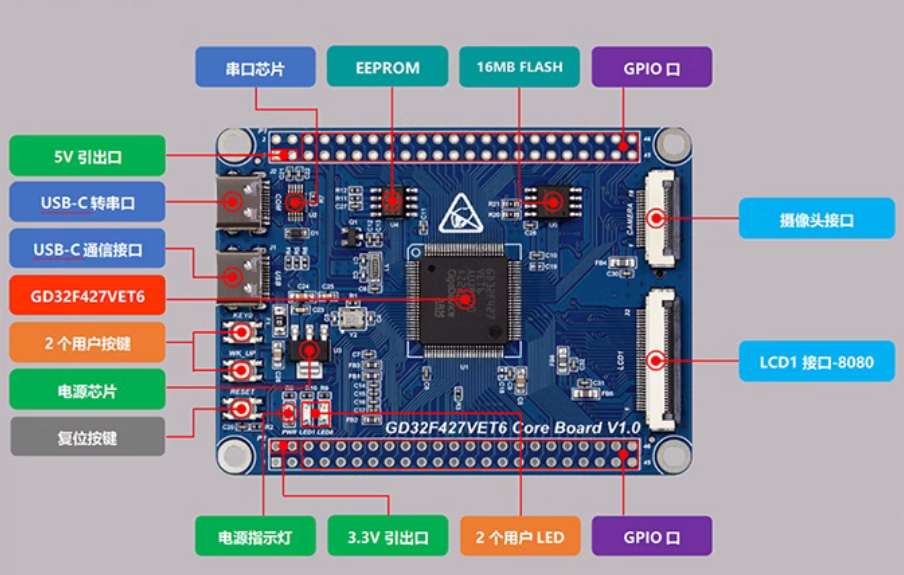

# 和其光电MCU工程示例

# 项目介绍

| 分支名       | 所支撑的项目   | 项目介绍                         |
| ------------ | -------------- | -------------------------------- |
| master       | 准确的项目名称 | 项目的主要功能和用途的简短描述。 |
| product/xxx1 | 准确的项目名称 | 项目的主要功能和用途的简短描述。 |
| product/xxx2 | 准确的项目名称 | 项目的主要功能和用途的简短描述。 |

# 硬件平台

本示例工程采用公司购买GD32F427VET6开发板，开发板照片如下图：

# 系统框图

系统框图展示了硬件各部分的组合关系，由嵌入式软件设计工程师在开发初期依据硬件原理图输出。建议使用以下工具之一进行框图的创建与维护：

* draw.io工具
* Visual Studio Code 的 draw.io 插件

# 关联硬件设计文档

硬件设计文档连接：[XXX](https://file+.vscode-resource.vscode-cdn.net/e%3A/HQ_PROJECT/Optsensor-MCU-DevPlat/samples/gd32f427vet6/app/README.md)

> 硬件设计文档仓库由硬件工程师创建，并提供仓库链接及对应的权限。
>
> 硬件设计文档应至少包含PCB、SCH、PDF等设计文件。

> 注意：对应的硬件版本发生变更后请更新连接

# 协议相关文档

这里给出协议/指令文档链接。

# 问题和讨论

如果您有任何问题或想要讨论，请使用”议题“（issue）跟踪系统记录相关问题

# 联系我们

维护者信息：姓名/工号
