# LED102-V3 固件框架说明

> 产品：LED102-v3 · MCU：GD32F427 · RTOS：FreeRTOS · 公司：西安和其光电科技股份有限公司
>
> 固件版本：V1.0.50 · 硬件版本：V1.0.1 · Bootloader：V1.0.4

---

## 目录

1. [总体架构](#1-总体架构)
2. [Flash 分区](#2-flash-分区)
3. [Bootloader 流程](#3-bootloader-流程)
4. [App 启动流程](#4-app-启动流程)
5. [架构层（arch）](#5-架构层arch)
6. [系统业务层（sys）](#6-系统业务层sys)
7. [测温流水线](#7-测温流水线)
8. [通信层（comm / proto）](#8-通信层comm--proto)
9. [UI 层](#9-ui-层)
10. [参数管理（para）](#10-参数管理para)
11. [数据记录（record）](#11-数据记录record)
12. [BSP 层](#12-bsp-层)
13. [第三方库](#13-第三方库)
14. [RTOS 任务全景](#14-rtos-任务全景)
15. [OSTimer 调度槽](#15-ostimer-调度槽)
16. [关键宏配置速查](#16-关键宏配置速查)

---

## 1. 总体架构

```
┌──────────────────────────────────────────────────────────────────┐
│                         应用业务层 (src/app)                      │
│                                                                  │
│  ┌──────────┐ ┌──────────┐ ┌──────────┐ ┌──────┐ ┌──────────┐  │
│  │  sys/    │ │  comm/   │ │  proto/  │ │  ui/ │ │  para/   │  │
│  │(系统管理)│ │(通信配置)│ │(协议解析)│ │(界面)│ │(参数管理)│  │
│  └──────────┘ └──────────┘ └──────────┘ └──────┘ └──────────┘  │
│                              ┌──────────┐                        │
│                              │ record/  │                        │
│                              │(数据记录)│                        │
│                              └──────────┘                        │
├──────────────────────────────────────────────────────────────────┤
│                         架构支撑层 (src/app/arch)                 │
│  agent · ostimer · thread · message · mailbox                    │
│  storage · serial · scom · console                               │
├──────────────────────────────────────────────────────────────────┤
│                         板级支持层 (src/bsp)                      │
│  dev/（AD7124 · LTC2606 · OV5640 · TM1639 · EEPROM · ...）       │
│  periph/（UART · SPI · ETH · DMA · Timer · RTC · ADC · DAC…）    │
├──────────────────────────────────────────────────────────────────┤
│          第三方库：FreeRTOS · lwIP · USB Host · CMBacktrace       │
└──────────────────────────────────────────────────────────────────┘
                             GD32F427 硬件
```

### 源码目录结构

```
src/
├── app/
│   ├── app_main.c / boot_main.c   ← 双入口（APP / Bootloader）
│   ├── platform.h / app_cfg.h / tools_cfg.h
│   ├── arch/      ← 架构支撑层
│   ├── sys/       ← 系统业务（测温 / 模拟输出 / 报警 / 加热器 ...）
│   ├── comm/      ← 通信通道配置
│   ├── proto/     ← 协议帧解析与命令分发
│   ├── ui/        ← 显示 / 按键
│   ├── para/      ← 参数管理
│   └── record/    ← 日志记录
├── bsp/
│   ├── dev/       ← 器件驱动（AD7124 / LTC2606 / OV5640 ...）
│   └── periph/    ← 外设驱动（GD32 LL 封装）
├── freertos/      ← FreeRTOS 内核
├── lwip/          ← lwIP 协议栈
├── usb/           ← USB Host（UVC）
└── utils/         ← cm_backtrace · systemview
```

---

## 2. Flash 分区

```
GD32F427 内部 Flash（512 KB）
┌────────────────────────────────────────────────────────┐
│ 地址              │ 扇区 │  大小  │  用途               │
├────────────────────┼──────┼────────┼─────────────────────┤
│ 0x0800_0000        │  S0  │  16 KB │  Bootloader         │
│ 0x0800_4000        │  S1  │  16 KB │  升级固件头(FW_INFO) │
│ 0x0800_8000        │  S2  │  16 KB │  用户参数 + 快速保存 │
│ 0x0800_C000        │  S3  │  16 KB │  工厂参数(FACTORY)  │
│ 0x0801_0000        │  S4  │  64 KB │  APP（主区）        │
│ 0x0802_0000        │  S5  │ 128 KB │  APP（续区）        │
│ 0x0804_0000        │  S6  │ 128 KB │  OTA 升级数据（1/2）│
│ 0x0806_0000        │  S7  │ 128 KB │  OTA 升级数据（2/2）│
└────────────────────┴──────┴────────┴─────────────────────┘
```

| 符号 | 值 | 说明 |
|------|----|------|
| `FW_INFO_ADDR` | `0x0800_4000` | 升级固件头（`fw_info_t`），含 CRC32 和 img_size |
| `USER_PARA_ADDR` | `0x0800_8000` | 用户参数（CRC16 校验） |
| `QUICK_SAVE_ADDR` | `0x0800_A000` | 热启动快速保存参数 |
| `FACTORY_PARA_ADDR` | `0x0800_C000` | 工厂参数（生产线写入） |
| `APP_ENTRY_ADDR` | `0x0801_0000` | APP 入口（向量表偏移 `0x10000`） |
| `FW_DATA_ADDR` | `0x0804_0000` | OTA 固件数据存储区 |
| `FIRMWARE_INFO_ADDR` | `APP+0x400` | bin 文件内版本信息偏移（`firmware_info_t`） |

### EEPROM（AT24CM01，1 Mbit）分区

```
┌────────────────────────────────────────────────────────┐
│ 偏移地址          │  大小   │  用途                      │
├────────────────────┼─────────┼────────────────────────────┤
│ 0x0000            │  4 KB   │  备份参数（BACKUP_PARA）    │
│ 0x1000            │  256 B  │  日志索引（REC_INDEX）      │
│ 0x1100            │ ~59 KB  │  黑盒日志（BBox）           │
│ 0xF780            │ ~67 KB  │  状态日志（State）          │
│ 0x1FF00           │  64 B   │  存储测试区                 │
│ 0x20000           │  —      │  END                        │
└────────────────────┴─────────┴────────────────────────────┘
```

---

## 3. Bootloader 流程

**入口文件**：`src/app/boot_main.c`

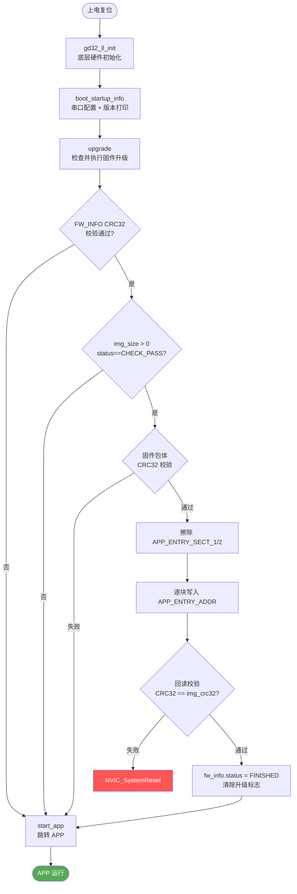

### start_app() 跳转时序

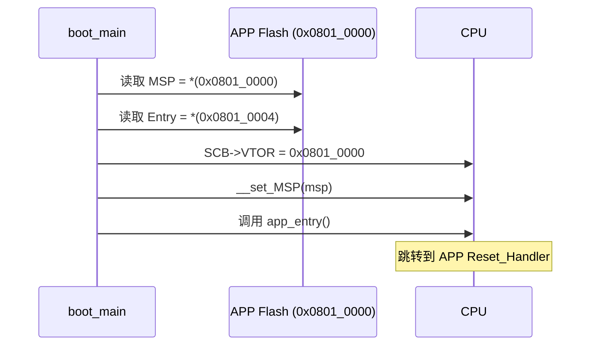

---

## 4. App 启动流程

**入口文件**：`src/app/app_main.c`

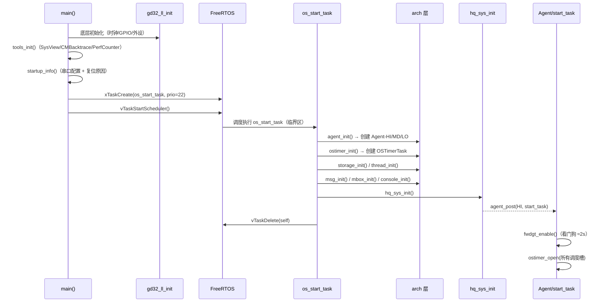

### 冷启动 vs 热启动

```mermaid
flowchart LR
    P([上电]) --> A{start_flag ==\n0xA55AB66B?}
    A -- 否(冷启动) --> B[正常初始化\ndev_state |= COOL_START]
    A -- 是(热启动) --> C[hot_start_quick_save_get\n加载快速保存参数\ndev_state |= WARM_START]
    B --> D[start_flag = 0xA55AB66B]
    C --> D
    D --> E([继续初始化])

    note1["start_flag 位于 NO_INIT 段\n断电清零 → 冷启动\n复位保留 → 热启动"]
```

---

## 5. 架构层（arch）

> **目录**：`src/app/arch/`

| 模块 | 文件 | 功能 |
|------|------|------|
| Agent | `agent.c/h` | 3 优先级（HI/MD/LO）函数队列，FreeRTOS 任务驱动 |
| OSTimer | `ostimer.c/h` | 周期性定时调度，通过 `agent_post` 派发 |
| Thread | `thread.c/h` | 用户线程池（最多 13 个） |
| Message | `message.c/h` | 消息队列（容量 50） |
| MailBox | `mail_box.c/h` | 邮箱 IPC（8 个邮箱，每个容量 8） |
| Storage | `storage.c/h` | Flash / EEPROM 存储抽象 |
| Serial | `serial.c/h` | 串口底层驱动封装 |
| Scom | `scom.c/h` | 串口通信管理 |
| Console | `console.c/h` | 调试控制台 |

### Agent 机制

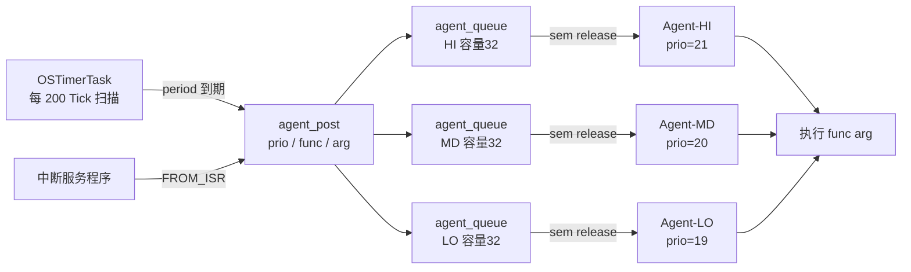

### OSTimer 调度机制

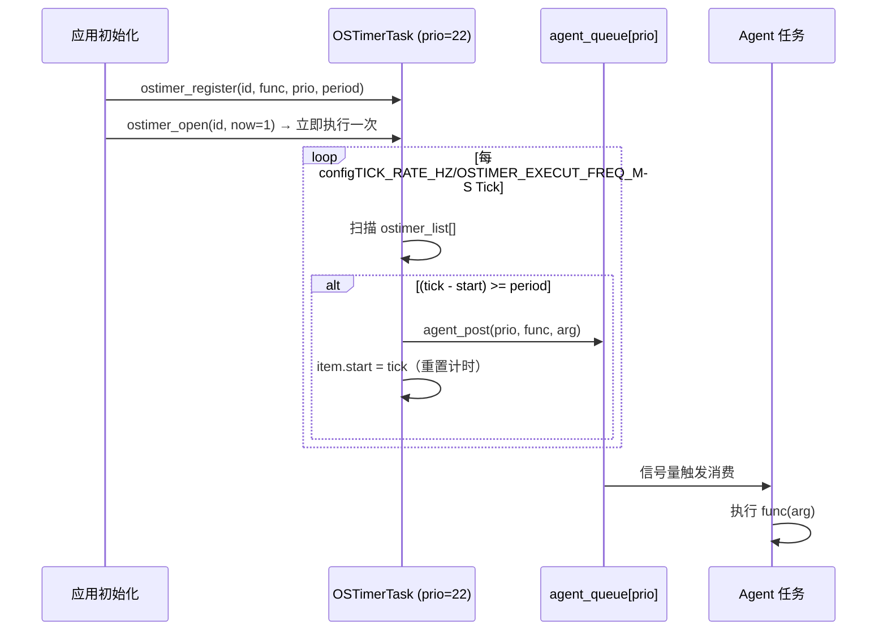

### API 速查

```c
/* 注册（初始化时，临界区内） */
ostimer_register(OSTIMER_xxx, func, arg, AGENT_PRIO_HI, period_ticks);

/* 开启/关闭 */
ostimer_open(OSTIMER_xxx, 1);   // 1 = 立即执行
ostimer_close(OSTIMER_xxx);

/* 运行时调整 */
ostimer_set_period(OSTIMER_xxx, new_period);
ostimer_set_prio(OSTIMER_xxx, AGENT_PRIO_MD);
ostimer_restart(OSTIMER_xxx);   // 重置计时起点

/* 投递单次任务 */
agent_post(NOT_FROM_ISR, AGENT_PRIO_HI, func, arg);
agent_post(FROM_ISR,     AGENT_PRIO_LO, func, arg);
```

---

## 6. 系统业务层（sys）

> **目录**：`src/app/sys/`

### hq_sys_init() 初始化序列

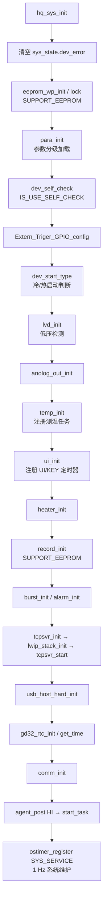

### 模块文件一览

| 文件 | 功能 | OSTimer 槽 |
|------|------|-----------|
| `system.c/h` | 系统初始化、版本管理、互斥锁、复位原因 | `SYS_SERVICE` |
| `measure.c/h` | 红外测温（采样 + 温度处理） | 独立任务（`sample_task`） |
| `analogout.c/h` | 模拟输出（LTC2606，0-20mA/4-20mA/0-10V） | — |
| `alarm.c/h` | 报警（目标温度/内部温度/衰减率） | `ALARM_TASK` |
| `burst.c/h` | 突发/轮询上报 | `BURST_TASK` |
| `camera.c/h` | OV5640 摄像头管理 | `CAMERA_TASK`（暂停） |
| `heater.c/h` | 加热器 PID 控制 | `HEATER_TASK` |
| `record.c/h` | 黑盒/状态日志写入 EEPROM | `RECORD_TASK` |
| `self_check.c/h` | 开机自检（EEPROM/RTC/AD7124/LTC2606…） | — |
| `tiag.c/h` | 跨阻放大器三档增益切换（L/M/H） | — |
| `upgrade.c/h` | 固件升级辅助（CRC / Flash 写入） | — |
| `console.c/h` | 调试控制台命令处理 | — |

### DAC / Camera 互斥保护

LTC2606（DAC）与 OV5640（Camera）共用 SPI/GPIO，需互斥：

```c
dac_camera_lock();    // xSemaphoreTake(dac_camera_mutex, 500ms)
// ... 操作 LTC2606 或 OV5640 ...
dac_camera_unlock();  // xSemaphoreGive(dac_camera_mutex)
```

---

## 7. 测温流水线

### 任务分工

| 任务 | 类型 | 优先级 | 职责 |
|------|------|--------|------|
| `sample_task` | FreeRTOS 独立任务 | 23（最高） | 读取 AD7124 四路原始 ADC 值 |
| `temp_task` | 由 `sample_task` 直接调用 | 同上 | 数字信号处理 → 温度计算 → 模拟输出 |

> **注**：当前实现中 `temp_task` 嵌入 `sample_task` while 循环末尾直接调用，非独立定时触发。

### 采样阶段（sample_task）

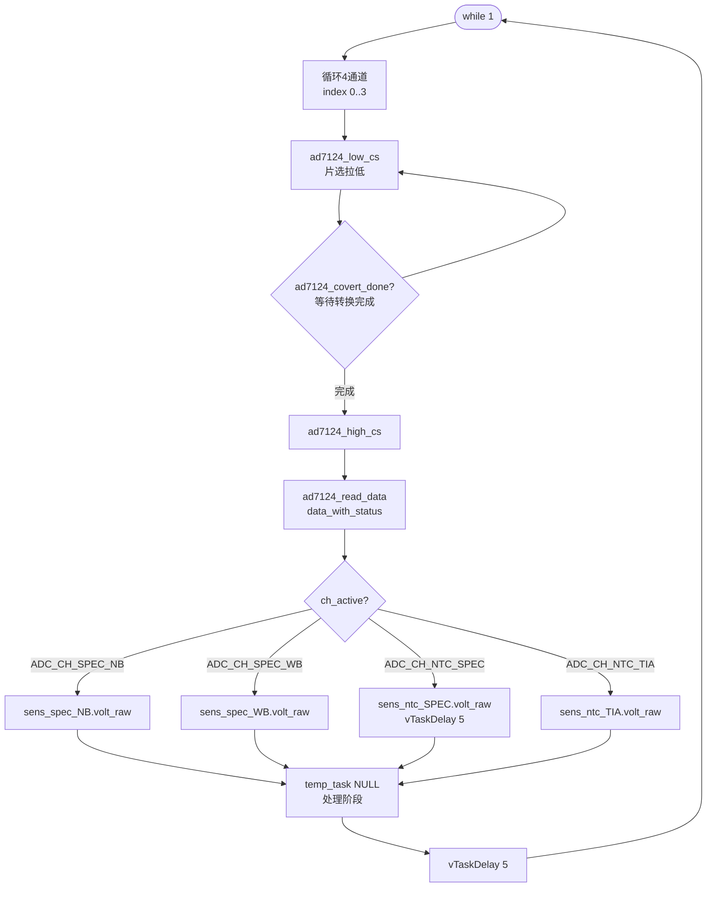

### 处理阶段（temp_task）

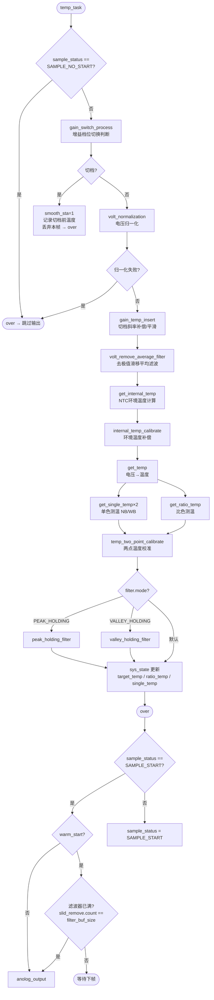

### 增益切换状态机（tiag）

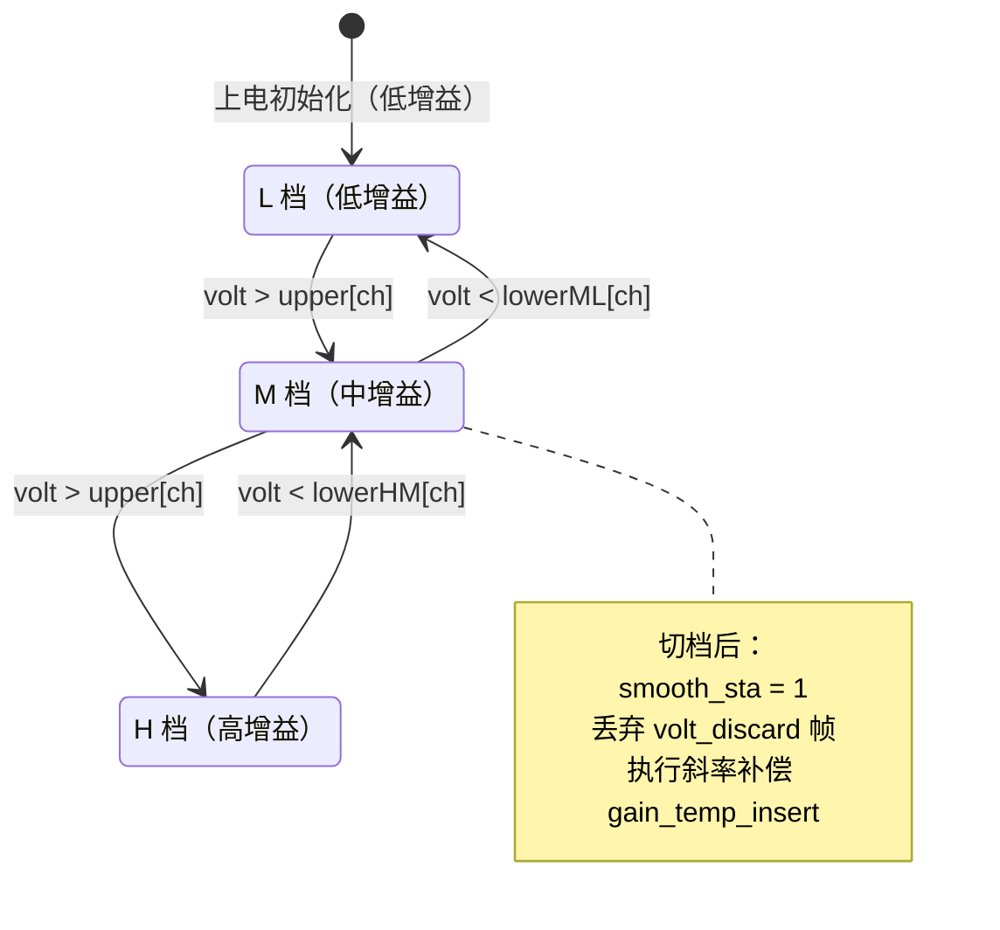

### 测温模式选择

| `temp_mode` | 模式 | 输出温度来源 |
|-------------|------|------------|
| 0 | 单色-宽带（WB） | `single_temp[SENS_CH_SPEC_WB]` |
| 1 | 单色-窄带（NB） | `single_temp[SENS_CH_SPEC_NB]` |
| 2 | 比色 | `ratio_temp` |

### 模拟输出映射

```
target_temp ──► 线性映射 ──► DAC 码值 ──► LTC2606 ──► 输出
[dev_temp_min ~ dev_temp_max]    [0-20mA / 4-20mA / 0-10V]
                                  (sys_para.ana.type)
```

---

## 8. 通信层（comm / proto）

> **目录**：`src/app/comm/`，`src/app/proto/`

### 模块结构

```
comm/
  ├── comm_cfg.c/h    — 物理通道配置（COM2 RS422，半/全双工，DMA）
  ├── pc.c/h          — PC 端串口通信处理
  └── tcp_server.c/h  — TCP 服务器（基于 lwIP）

proto/
  ├── proto_base.c/h      — 基础协议帧收发引擎
  ├── proto_base_cfg.c/h  — 协议帧参数配置
  ├── proto_char.c/h      — 字符型 ASCII 协议命令处理
  ├── proto_char_cfg.c/h  — 命令注册表配置
  ├── proto_coef.c/h      — 系数（标定数据）协议
  └── cmd_list.h          — 全局命令 ID 列表
```

### 通信通道

| 通道 | 接口 | 引脚 | 模式 | 说明 |
|------|------|------|------|------|
| COM2 | USART2 | TXD=PD8, RXD=PD9 | RS422，半/全双工 | 主通信口，DMA 收发 |
| TCP | ETH | — | lwIP TCP Server | 网络通信 |

### 网络初始化时序

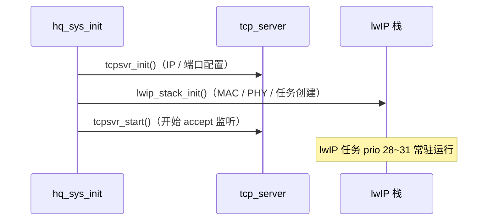

---

## 9. UI 层

> **目录**：`src/app/ui/`

| 文件 | 功能 |
|------|------|
| `ui.c/h` | UI 任务（`OSTIMER_UI_TASK`）：菜单导航 + 显示刷新 |
| `display.c/h` | TM1639 / OLED 显示驱动封装 |
| `key.c/h` | 按键任务（`OSTIMER_KEY_SCAN_TASK`）：扫描、消抖、发消息 |

> **注意**：UI/KEY 回调为 OSTimer 调度，避免在回调内执行耗时操作，防止影响其他定时任务。

---

## 10. 参数管理（para）

> **目录**：`src/app/para/`

### 参数分层模型

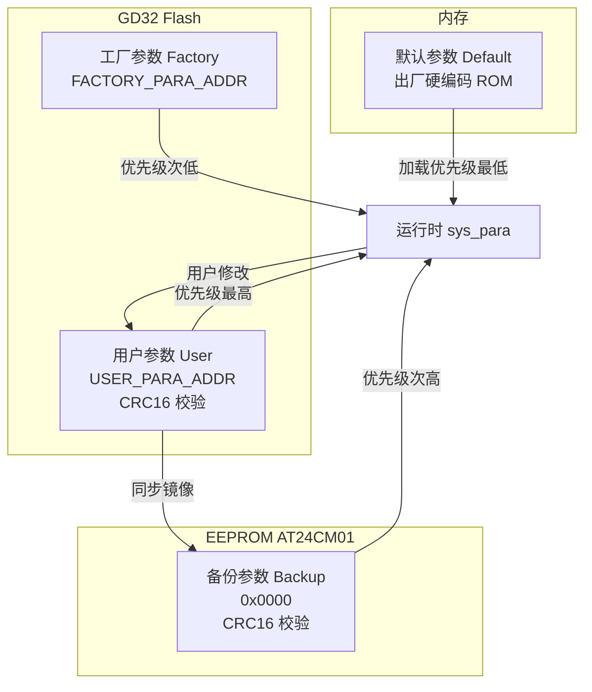

### 参数分组（sys_para_t）

| 组号 | 枚举 | 结构体 | 主要内容 |
|------|------|--------|---------|
| 0 | `PARA_DEV` | `dev_para_t` | 设备地址、名字、SN、工厂标志 |
| 1 | `PARA_PORT` | `port_para_t` | 串口模式、波特率、调试等级 |
| 2 | `PARA_GAIN` | `gain_para_t` | 跨阻切档阈值（upper/lower）、系数 k_lm/k_mh |
| 3 | `PARA_ANA` | `ana_para_t` | 模拟输出类型、上下限、校准值、响应时间 |
| 4 | `PARA_ADC` | — | ADC 配置 |
| 5 | `PARA_TEMP` | `temp_para_t` | 测温模式、发射率、透射率、量程、滤波长度 |
| 6 | `PARA_NET` | `net_para_t` | IP/掩码/网关、DHCP、端口、超时 |
| 7 | `PARA_RECORD` | `record_para_t` | 日志保存间隔 |
| 8 | `PARA_ALGO` | — | 算法参数 |
| 9 | `PARA_BURST` | `burst_para_t` | 突发速度、格式、命令列表、模式 |
| 10 | `PARA_ALARM` | `alarm_para_t` | 继电器报警模式、目标/内部温度阈值、衰减率 |
| 11 | `PARA_VIDEO` | `video_para_t` | 瞄准坐标、曝光、亮度、视频控制 |
| 12 | `PARA_FILTER` | `filter_para_t` | 滤波 buf 大小、峰/谷值保持时间、模式选择 |
| 13 | `PARA_HEATER` | `heater_para_t` | 加热目标温度、PID 参数（kp/ki/kd） |

### 参数加载流程（para_init）

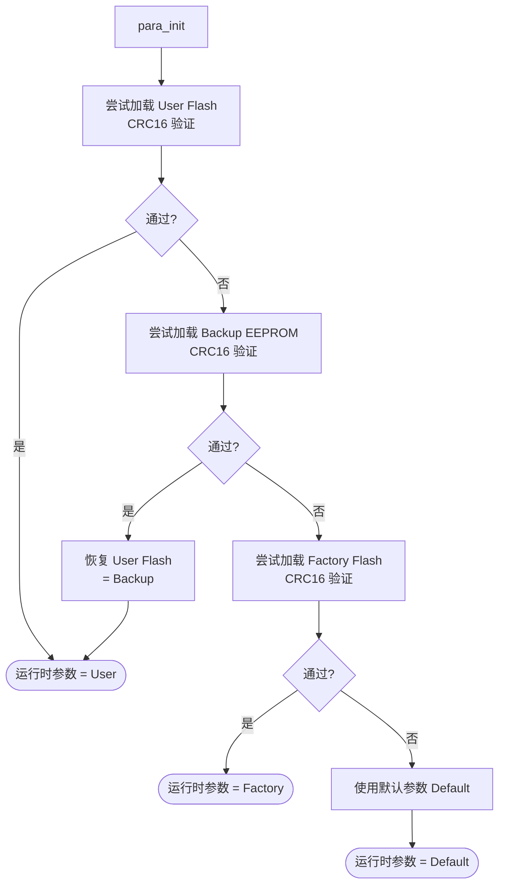

### 热启动快速保存

```c
sys_quick_save();              // 掉电/复位前保存关键状态至 QUICK_SAVE_ADDR
hot_start_quick_save_get();    // 热启动时恢复，跳过滤波器预热等待
```

---

## 11. 数据记录（record）

> **目录**：`src/app/record/`

| 类型 | EEPROM 地址 | 容量 | 说明 |
|------|-------------|------|------|
| 黑盒日志（BBox） | `0x1100 ~ 0xF780` | ≈59 KB | 运行事件记录 |
| 状态日志（State） | `0xF780 ~ 0x1FF80` | ≈67 KB | 周期状态快照 |
| 索引 | `0x1000` | 256 B | 两类日志的读写指针 |

---

## 12. BSP 层

### 设备驱动（`src/bsp/dev/`）

| 设备 | 文件 | 接口 | 说明 |
|------|------|------|------|
| AD7124 | `ad7124.c/h` | SPI | 24位 ADC，4路采样（NB/WB/NTC×2） |
| LTC2606 | `ltc2606.c/h` | SPI | 16位 DAC，模拟输出 |
| OV5640 | `ov5640.c/h` | DCI+I2C | 500万像素摄像头 |
| TM1639 | `tm1639.c/h` | GPIO | LED 数码管显示 |
| OLED | `oled.c/h` | SPI | OLED 显示屏 |
| VTI7064x | `vti7064x.c/h` | — | PSRAM |
| EEPROM | `eeprom.c/h` | I2C | AT24CM01（1Mbit） |
| DS18B20 | `ds18b20.c/h` | 1-Wire | 数字温度传感器 |
| Soft I2C | `soft_i2c.c/h` | GPIO | 软件模拟 I2C |

### 外设驱动（`src/bsp/periph/`）

| 外设 | 文件 |
|------|------|
| UART | `gd32_uart.c/h` |
| SPI | `gd32_spi.c/h` |
| DMA | `gd32_dma.c/h` |
| ETH | `gd32_eth.c/h` |
| Timer | `gd32_timer.c/h` |
| RTC | `gd32_rtc.c/h` |
| ADC | `gd32_adc.c/h` |
| DAC | `gd32_dac.c/h` |
| DCI | `gd32_dci.c/h` |
| FMC | `gd32_fmc.c/h` |
| CRC | `gd32_crc.c/h` |
| EXTI | `gd32_exti.c/h` |
| EXMC | `gd32_exmc.c/h` |
| LL初始化 | `gd32_ll.c/h` |

---

## 13. 第三方库

| 库 | 目录 | 用途 |
|----|------|------|
| FreeRTOS | `src/freertos/` | 实时操作系统内核 |
| lwIP | `src/lwip/` | TCP/IP 协议栈 |
| USB | `src/usb/` | USB Host（UVC 摄像头） |
| CMBacktrace | `src/utils/cm_backtrace/` | Cortex-M 崩溃日志 |
| SystemView | `src/utils/systemview/` | RTOS 实时性能分析 |

---

## 14. RTOS 任务全景

```mermaid
gantt
    title RTOS 任务优先级分布（数值越大优先级越高）
    dateFormat X
    axisFormat %s
    section 采样
        sample_task (prio=23)       :23, 24
    section 调度
        os_start_task (prio=22, 启动后删除) :22, 23
        OSTimerTask (prio=22)       :22, 23
    section Agent
        Agent-HI (prio=21)          :21, 22
        Agent-MD (prio=20)          :20, 21
        Agent-LO (prio=19)          :19, 20
    section 用户线程
        User Threads (prio≤24)      :18, 19
    section 网络
        lwIP 任务 (prio 28~31)      :28, 32
```

| 任务名 | 优先级 | 栈大小（Words） | 生命周期 | 说明 |
|--------|--------|----------------|----------|------|
| `sample_task` | **23** | 1024 | 常驻 | AD7124 采样（最高业务优先级） |
| `os_start_task` | 22 | 1024 | 启动后删除 | 系统初始化入口 |
| `OSTimerTask` | 22 | 2048 | 常驻 | 定时调度器 |
| `Agent-HI` | 21 | 1024 | 常驻 | 高优先级函数队列（测温/报警） |
| `Agent-MD` | 20 | 512 | 常驻 | 中优先级函数队列 |
| `Agent-LO` | 19 | 512 | 常驻 | 低优先级函数队列（日志/UI） |
| lwIP 任务组 | 28~31 | — | 常驻 | TCP/IP 协议栈 |
| 用户线程池 | ≤24 | — | 按需 | 最多 13 个（`USER_THREAD_CNT`） |

---

## 15. OSTimer 调度槽

| ID | 枚举 | 回调函数 | 代理优先级 | 注册位置 | 状态 |
|----|------|----------|-----------|---------|------|
| 0 | `OSTIMER_SYS_SERVICE` | `service_task` | HI | `hq_sys_init` | ✅ 启用 |
| 1 | `OSTIMER_CAMERA_TASK` | camera 任务 | — | `camera_init` | 🔇 暂停 |
| 2 | `OSTIMER_UI_TASK` | `ui_task` | — | `ui_init` | ✅ 启用 |
| 3 | `OSTIMER_BURST_TASK` | burst 任务 | — | `burst_init` | ✅ 启用 |
| 4 | `OSTIMER_KEY_SCAN_TASK` | `key_task` | — | `ui_init` | ✅ 启用 |
| 5 | `OSTIMER_RECORD_TASK` | record 任务 | — | `record_init` | ✅ 启用 |
| 6 | `OSTIMER_ALARM_TASK` | alarm 任务 | — | `alarm_init` | ✅ 启用 |
| 7 | `OSTIMER_USB_UVC_TASK` | USB UVC 任务 | — | — | ✅ 启用 |
| 8 | `OSTIMER_DATA_SEND_TASK` | 数据发送 | — | — | 🔇 暂停 |
| 9 | `OSTIMER_UVC_CTL_TASK` | UVC 控制 | — | — | — |
| 10 | `OSTIMER_HEATER_TASK` | heater 任务 | — | `heater_init` | ✅ 启用 |

> `OSTIMER_EXECUT_FREQ_MS = 200`：OSTimerTask 每 `configTICK_RATE_HZ / 200` Tick 扫描一次。

### OSTimer 生命周期

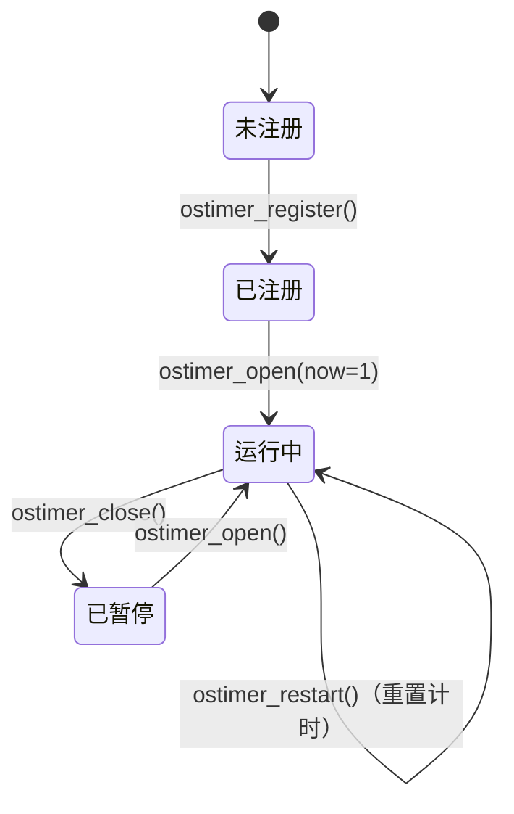

---

## 16. 关键宏配置速查

### 版本号（`src/app/app_cfg.h`）

| 宏 | 值 | 说明 |
|----|----|----|
| `BOOT_VER_MAJOR/MINOR/SERIAL` | 1.0.4 | Bootloader 版本 |
| `HW_VER_MAJOR/MINOR/SERIAL` | 1.0.1 | 硬件版本 |
| `FW_VER_MAJOR/MINOR/SERIAL` | 1.0.50 | 固件版本 |

### 测温相关（`app_cfg.h`）

| 宏 | 值 | 说明 |
|----|----|----|
| `TEMP_UPPER` | 3500 | 测温上限（×0.1°C = 350.0°C） |
| `TEMP_LOWER` | 300 | 测温下限（×0.1°C = 30.0°C） |
| `SENS_CH_SPEC_WB` | 0 | 宽带光谱通道索引 |
| `SENS_CH_SPEC_NB` | 1 | 窄带光谱通道索引 |
| `SENS_CH_SPEC_CNT` | 2 | 光谱通道总数 |
| `SENS_CH_NTC_CNT` | 2 | NTC 通道总数（SPEC + TIA） |

### 增益档位参数（`sys_para.gain`）

| 参数 | 说明 |
|------|------|
| `gain.upper[ch]` | 切档上限电压（L→M / M→H） |
| `gain.lowerml[ch]` | 切档下限电压 M→L |
| `gain.lowerhm[ch]` | 切档下限电压 H→M |
| `gain.k_lm[ch]` | L 档→M 档归一化系数 |
| `gain.k_mh[ch]` | M 档→H 档归一化系数 |
| `gain.cnt_thod` | 切档阈值检测区间帧数 |
| `gain.volt_discard` | 切档后丢弃帧数 |

### 滤波参数（`sys_para.filter`）

| 参数 | 说明 |
|------|------|
| `filter.temp_filter_buf_size` | 滤波器缓冲区大小（热启动等待填满） |
| `filter.mode` | 滤波模式：`PEAK_HOLDING` / `VALLEY_HOLDING` / 默认 |
| `filter.peak_holding_time` | 峰值保持时间（秒） |
| `filter.valley_holding_time` | 谷值保持时间（秒） |

### 系统行为开关（`app_cfg.h` / `arch_cfg.h`）

| 宏 | 值 | 说明 |
|----|----|----|
| `VECTOR_TAB_OFFSET` | `0x10000` | APP 向量表偏移 |
| `WARM_START_MAGIC` | `0xA55AB66B` | 热启动密钥 |
| `OSTIMER_EXECUT_FREQ_MS` | 200 | OSTimer 扫描周期（Tick） |
| `AGENT_QUEUE_SIZE` | 32 | 代理队列容量 |
| `SUPPORT_EEPROM` | 1 | 使用外部 EEPROM（AT24CM01） |
| `SUPPORT_GDFLASH` | 1 | 使用 GD32 内部 Flash |
| `IS_USE_SELF_CHECK` | 0/1 | 开机自检 |
| `USE_SYSTEMVIEW_TOOL` | 0/1 | SEGGER SystemView |
| `USE_CM_BACKTRACE_TOOL` | 0/1 | 崩溃回溯 |
| `USE_PERF_COUNTER_TOOL` | 0/1 | 性能计数器（`time_shift_ms`） |

---

*本文档由 GitHub Copilot 自动生成，描述截止于 2026-05-21。*

