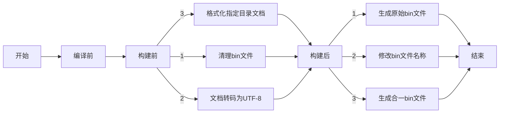

# 工具介绍

tools目录下的工具主要针对MCU平台的工程进行使用，期望通过一套工具支撑多个工程，如果在使用中出现问题，请不要仅对单一工程做适配。

## 工具执行流程图



- **开始**：流程的起点。
- **编译前**：表示编译过程开始之前的阶段，当前阶段没有执行任何自定义脚本。
- **构建前**：这个阶段包括三个步骤：
  - 清理之前生成的bin文件。
  - 对所有文档进行转码，统一为utf-8。
  - 对几个指定目录的文档进行格式化。
- **构建后**：构建过程结束后的阶段，包括三个步骤：
  - 生成原始bin文件。
  - 修改bin文件名称，插入版本号、时戳、校验码等。
  - 生成合一bin文件。

## convertEncoding.py

MCU类的工程统一使用utf-8编码。keil编码格式统一设置为utf-8。如果keil设置为GB2312仍可以正常浏览utf-8编码的文本文件，但是新创建的文件为gb2312，不利于统一编码。

### 功能

对某个目录下的文档进行编码转换

### 使用方法

#### 环境依赖

需要安装python 3.10以上版本

#### 查看帮助信息

```
python convertEncoding.py -h
```

#### utf-8转GB2312

```
python .\app\tools\convertEncoding.py -s utf-8  -t GB2312
```

#### GB2312转utf-8

```
python .\app\tools\convertEncoding.py -t utf-8  -s GB2312
```

#### 注意事项

* 配置参数中的编码格式对大小写敏感
* 其他类型转换可能存在问题，需要验证

## clang-format.exe

### 功能

Clang-Format 是一个用于自动格式化 C、C++、Objective-C、Java、JavaScript、TypeScript 等编程语言源代码的工具。它是基于 Clang 编译器前端开发的,可以根据预定义的编码风格或自定义的格式规则,对代码进行样式重构和自动格式化。

类似的还有Astyle工具。Clang-Format相比Astyle设置更加灵活，缺点是不支持{}的生成与删除

### 使用方法

#### 环境依赖

无

#### 查看帮助信息

```
.\tools\clang-format.exe --help
```

[官方文档](https://releases.llvm.org/17.0.1/tools/clang/docs/ClangFormat.html)

#### 配置文件

所有的格式化配置最终都在配置文件.clang-format中承载。

> 注意：不要私自修改该文件，如果发现格式化有问题，可以再做讨论，最终要实现一套配置文件支撑所有MCU工程。

#### 特殊配置

针对一段代码屏蔽格式化

```
/* clang-format off */
代码段
/* clang-format on */
```

#### 使用

通过keil -> options for target project -> user  勾选format_all.bat脚本，通过改脚本调用clang-format实现格式化

#### 注意事项

格式化只针对和其开发的相关目录进行，对于外部引入的第三方库，不做格式化，目前只对如下目录进行格式化：

source/app

source/bsp

source/microlib

随着目录划分稳定后，最终只会针对一部分目录进行格式化。当前如果遇到有代码未格式化或者第三方库被格式化的情况，请及时沟通。

## format_all.bat

#### 功能

对脚本执行目录下的所有目标文件进行clang-format格式化，目前只针对".c"、".h"文件

#### 使用方法

在“keil -> options for target project -> user”勾选相应配置

## custom_cmd.cfg

### 功能

keil自定义命令功能配置

### 使用方法

#### 导入配置文件

Tools -> Customize Tools Menu -> Import -> 选中文件“custom_cmd.cfg”-> OK

#### 格式化当前打开文件

使用自定义命令 clang-format-current

#### 格式化所有文件

使用自定义命令 clang-format-all，实际上会格式化当前文件所在文件夹下所有目标文件

## clean_files.bat

### 功能

清理工程中的冗余文件：编译产物、日志文件、临时文件、IDE 配置文件等，具体删除哪些文件在.gitignore中进行了精确的配置

### 使用方法

双击执行，或者直接使用git命令。

```
git clean -nfdx
n: 表示 "dry-run"，即执行模拟操作,不实际删除文件。这样可以先查看会被删除的文件列表,确认无误后再执行实际操作。
f: 表示 "force"，即强制删除文件。
d: 表示删除未被跟踪的目录。
x: 表示删除 .gitignore 文件中指定的忽略文件。
```

## after_build.bat

### 功能

构建完成后调用bintobin.exe实现对应功能

`$P..\tools\after_build.bat ../output/bootloader ../output/app`

- `../output/bootloader`：这是bootloader的生成文件所在的路径。

- `../output/app`：这是应用程序（app）的生成文件所在的路径。

### 使用方法

在“keil -> options for target project -> user”勾选相应配置

## bintobin.exe

### 功能

* 将bootloader、与app的bin文件合二为一，方便批量烧录
* 将boot的bin文件、app的bin文件、二合一的bin文件以及根目录下的readme文件一起放到根目录下的output目录

### 使用方法

```
usage: bintobin.exe [-h] [-v] [-vf VERSION_FILE] [-b BOOT_FILE] [-a APP_FILE] [-o OUTPUT_PATH] [-alg {md5,sha1}] [-pos {tail,head}] [-boot-addr BOOT_ADDRESS] [-app-addr APP_ADDRESS]

options:
  -h, --help            show this help message and exit
  -v, --version         显示bintobin工具的版本号
  -vf VERSION_FILE, --version-file VERSION_FILE
                        版本信息所在的文件路径
  -b BOOT_FILE, --boot-file BOOT_FILE
                        bootloader的bin文件（或目录）路径，文件名要求以boot开头，不区分大小写，只提供目录的情况下会查找符合要求的最新文件
  -a APP_FILE, --app-file APP_FILE
                        应用程序的bin文件（或目录）路径，文件名要求以app开头，不区分大小写，只提供目录的情况下会查找符合要求的最新文件
  -o OUTPUT_PATH, --output-path OUTPUT_PATH
                        生成的bin文件存放的路径
  -alg {md5,sha1}, --algorithm {md5,sha1}
                        校验算法
  -pos {tail,head}, --position {tail,head}
                        校验信息添加位置
  -boot-addr BOOT_ADDRESS, --boot-address BOOT_ADDRESS
                        16进制，boot文件的起始烧录地址，使用相对地址，最终的bin文件起始地址为0
  -app-addr APP_ADDRESS, --app-address APP_ADDRESS
                        16进制，应用程序文件的起始烧录地址
```

eg：

```
%script_path%bintobin.exe -vf %script_path%..\app\source\app\app_cfg.h -b %boot_bin_dir% -a %script_path%..\output -o %script_path%..\output -boot-addr 8000000 -app-addr 0x8010000
```

## weekly_commit_report.py

### 功能

按周统计提交内容，默认只统计当前 git 用户（`git config user.name`）的提交，且默认不包含 merge 提交。

### 使用方法

在仓库根目录执行：

```bash
python tools/weekly_commit_report.py
```

#### 常见参数

```bash
# 统计最近4周
python tools/weekly_commit_report.py --since "4 weeks ago"

# 指定作者
python tools/weekly_commit_report.py --author "Your Name"

# 指定时间范围
python tools/weekly_commit_report.py --since "2026-01-01" --until "2026-12-31"

# 包含 merge 提交
python tools/weekly_commit_report.py --include-merges
```
